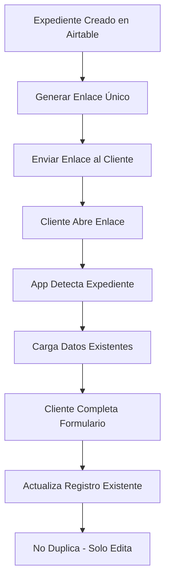

# 🎯 Sistema de Enlaces Únicos por Expediente

## ✅ **¿Qué se ha implementado?**

### **1. Mapeo Correcto de Campos**
- **"Detalles"** → Columna **"Detalles"** en Airtable ✅
- **"Foto roto"** → Solo se pide cuando hay problema físico ✅

### **2. Sistema de Enlaces Únicos**
- Cada expediente tiene su enlace único ✅
- Los clientes pueden editar registros existentes ✅
- Solo se actualiza la fila del expediente específico ✅

### **3. Nuevas Páginas y APIs**
- `/generate-link` → Página para generar enlaces únicos
- `/api/expediente` → API para buscar/actualizar expedientes
- `/api/generate-unique-link` → API para crear enlaces

## 🔗 **Cómo Funciona**

### **Paso 1: Generar Enlace Único**
1. Ve a: `https://tu-dominio.com/generate-link`
2. Introduce el número de expediente: `25643004`
3. Obtén el enlace único: `https://tu-dominio.com/?expediente=25643004`

### **Paso 2: Cliente Usa el Enlace**
1. El cliente abre el enlace único
2. La app detecta el expediente en la URL
3. Carga automáticamente los datos existentes:
   - **Cliente**: Gaspar Melis Riera
   - **Dirección**: CL BERNAT CAPO 15, 07...
   - **Problema**: (si ya está completado)
   - **Detalles**: (si ya están completados)

### **Paso 3: Cliente Completa/Edita**
1. Ve el formulario prellenado con sus datos
2. Completa los pasos faltantes:
   - Foto general del punto de recarga
   - Foto de la etiqueta
   - Selecciona el problema
   - Añade detalles (siempre obligatorio)
   - Foto de lo roto (solo si problema físico)

### **Paso 4: Actualización Automática**
1. Al enviar, se actualiza SOLO su registro en Airtable
2. No se crea un registro duplicado
3. Se actualiza la fecha de solicitud

## 📋 **Problemas Físicos que Piden Foto**

```typescript
const physicalDamageOptions = [
  'Soporte roto físicamente',
  'Manguera roto físicamente', 
  'Cargador roto físicamente'
];
```

**Si selecciona otro problema** → No se pide foto de roto  
**Si selecciona problema físico** → Foto de roto es obligatoria

## 🎨 **Interfaz Mejorada**

### **Indicador de Progreso Limpio**
- ❌ Eliminados los círculos con iconos (muy apretados en móvil)
- ✅ Barra de progreso horizontal
- ✅ "Paso X de Y" claro y visible
- ✅ Título del paso actual animado

### **Modo Edición Visual**
```
Expediente 25643004
Editando solicitud de Gaspar Melis Riera

[INFO BOX]
Cliente: Gaspar Melis Riera
Dirección: CL BERNAT CAPO 15, 07...
```

## 🔧 **Ejemplos de URLs**

### **Nueva Solicitud**
```
https://tu-dominio.com/
```

### **Editar Expediente Específico**
```
https://tu-dominio.com/?expediente=25643004
https://tu-dominio.com/?expediente=25643005
https://tu-dominio.com/?expediente=ABC123
```

### **Generar Enlaces**
```
https://tu-dominio.com/generate-link
```

## 📊 **Flujo de Datos**



## 🔒 **Seguridad**

- **Expedientes únicos**: Cada enlace solo accede a SU expediente
- **No listado**: No se pueden ver otros expedientes
- **Solo actualización**: No se pueden crear registros duplicados
- **Validación**: Se verifica que el expediente existe

## 🚀 **Para Usar en Producción**

1. **Configurar variables de entorno**:
   ```env
   NEXT_PUBLIC_BASE_URL=https://tu-dominio.com
   ```

2. **Proceso típico**:
   - Crear expediente en Airtable con datos básicos
   - Generar enlace único con `/generate-link`
   - Enviar enlace al cliente por email/SMS
   - Cliente completa su solicitud
   - Datos se actualizan automáticamente

¡El sistema está listo para usarse! 🎉
